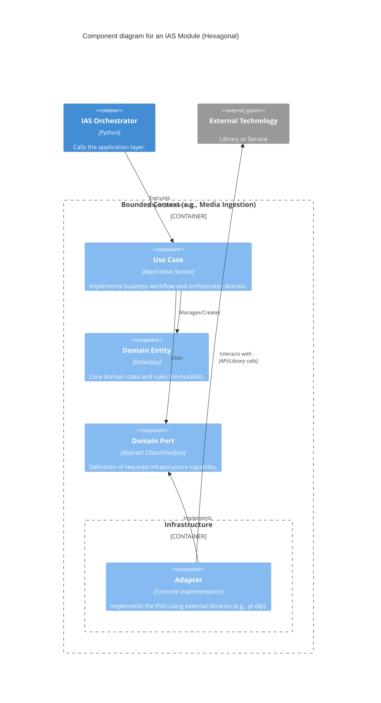

# C4 Components Diagram — IAS (Module Level)

## 🧩 Internal Component Structure
Each Bounded Context (Module) in IAS follows the same internal architectural pattern.

### Components Responsibilities

| Component | Responsibility | Independence |
| :--- | :--- | :--- |
| **Use Case** | Orchestrates domain entities and ports to satisfy a user story. | Independent of Infra. |
| **Domain Entity** | Represents a business concept and its state transitions. | Highest Independence. |
| **Domain Port** | Defines the contract for external communication (SPI). | Part of the Domain. |
| **Adapter** | Translates the domain contract into technical implementation. | Low Independence (coupled to tech). |

---

## 🟢 Confidence: CONFIRMADO
The project strictly implements these layers in `application/`, `domain/`, and `infrastructure/` subdirectories for every module.
