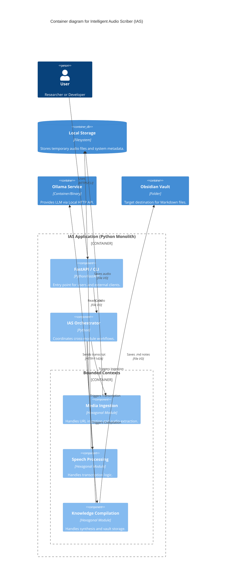

# C4 Containers Diagram — IAS

## 📦 Container Vision
The IAS system is designed as a Modular Monolith, where all modules run within the same process but are logically isolated.

| Container | Technology | Description |
| :--- | :--- | :--- |
| **IAS Application** | Python | The main application process containing all logic and modules. |
| **Local Storage** | Filesystem | Persistent storage for processed audio and local cache. |
| **Ollama Service** | Ollama | External local service for AI synthesis. |
| **Obsidian Vault** | Filesystem | The user's personal knowledge base folder. |
