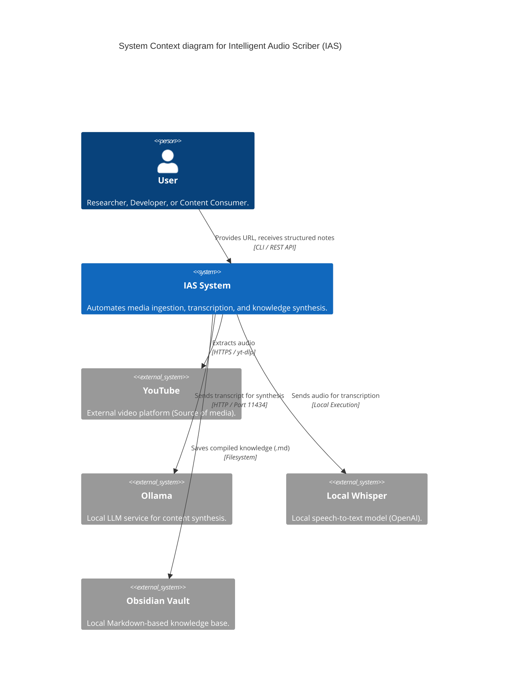

# C4 Context Diagram — IAS

## 🌐 System Context
The Intelligent Audio Scriber (IAS) is a tool for developers and researchers to automate the process of turning video content into structured notes.

| Element | Type | Description |
| :--- | :--- | :--- |
| **User** | Person | Interacts with IAS to process URLs and organize knowledge. |
| **IAS System** | Software System | The core application orchestrating the transformation pipeline. |
| **YouTube** | External System | External media provider accessed via the ingestion module. |
| **Ollama** | External System | Local service providing LLM capabilities (Llama3, etc.). |
| **Local Whisper** | External System | Local library/model for processing audio into text. |
| **Obsidian Vault** | External System | The target knowledge storage for the synthesized notes. |
