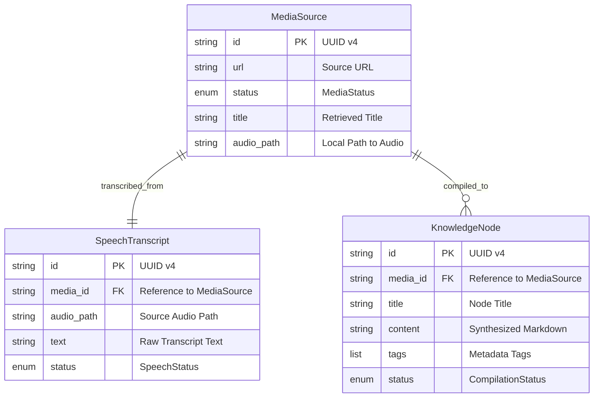

# ERD Complete — IAS

## 📊 Data Model (Domain Entities)
Although the system uses local storage and potentially SQLAlchemy, the primary data model is defined by the Domain Entities passed between modules.

## 🛠️ Data Relationships

1. **MediaSource (1:1) SpeechTranscript**:
    - Every media source that undergoes transcription has exactly one corresponding transcript entity.
    - Linked by `media_id`.

2. **MediaSource (1:N) KnowledgeNode**:
    - A media source can potentially be synthesized into multiple knowledge nodes (though current logic is 1:1).
    - Linked by `media_id`.

---

## 🟢 Confidence: CONFIRMADO
Entity attributes and types extracted directly from `domain/entities.py` files in each module.
