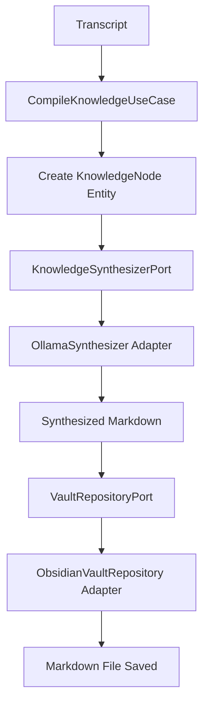
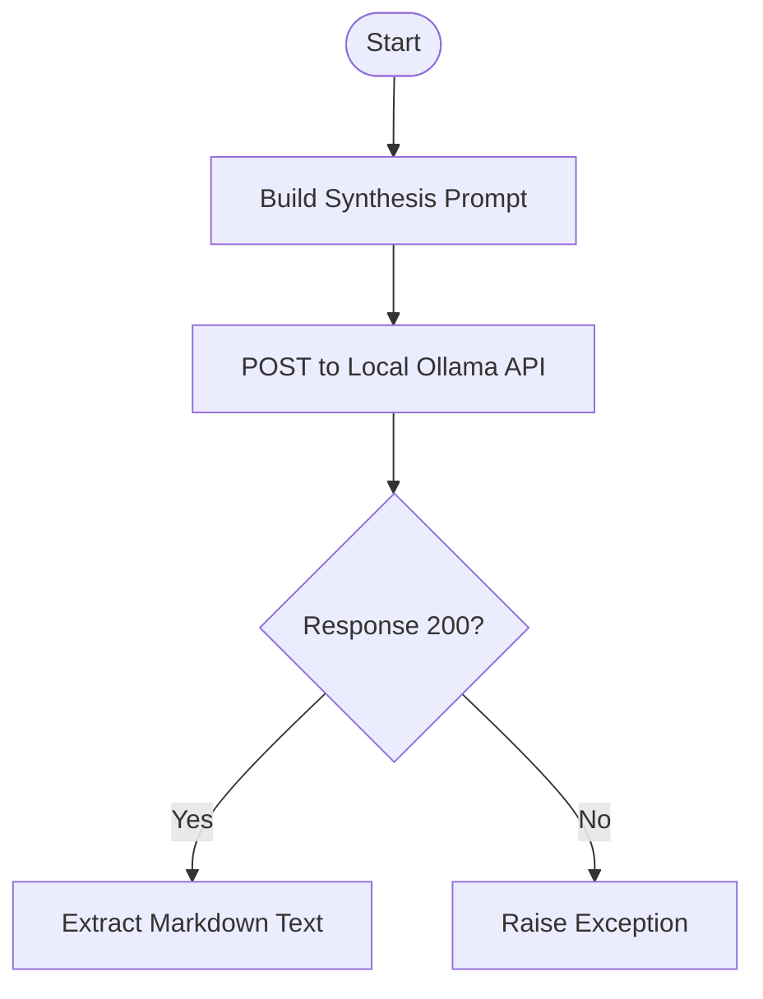
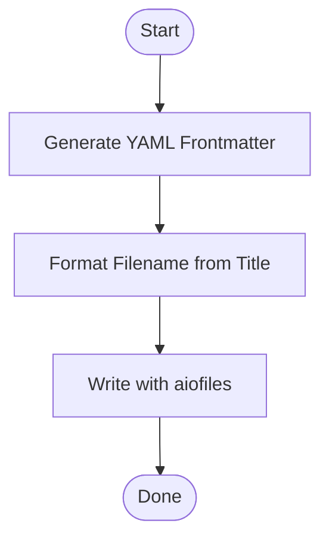

# Flowchart - KnowledgeCompilation

## Module Overview

```mermaid
graph TD
    A[Transcript] --> B[CompileKnowledgeUseCase]
    B --> C[Create KnowledgeNode Entity]
    C --> D[KnowledgeSynthesizerPort]
    D --> E[OllamaSynthesizer Adapter]
    E --> F[Synthesized Markdown]
    F --> G[VaultRepositoryPort]
    G --> H[ObsidianVaultRepository Adapter]
    H --> I[Markdown File Saved]
```

## Main Functions Logic

### OllamaSynthesizer.synthesize

```mermaid
flowchart TD
    Start([Start]) --> Prompt[Build Synthesis Prompt]
    Prompt --> API[POST to Local Ollama API]
    API --> Res{Response 200?}
    Res -- Yes --> Text[Extract Markdown Text]
    Res -- No --> Error[Raise Exception]
```

### ObsidianVaultRepository.save

```mermaid
flowchart TD
    Start([Start]) --> Meta[Generate YAML Frontmatter]
    Meta --> Path[Format Filename from Title]
    Path --> Write[Write with aiofiles]
    Write --> Done([Done])
```
