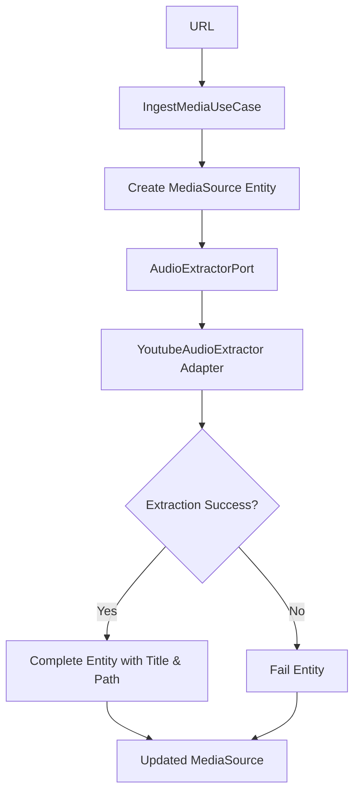
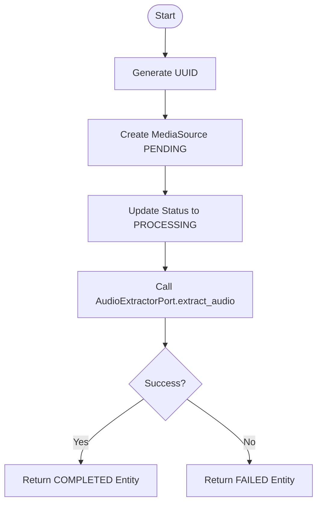
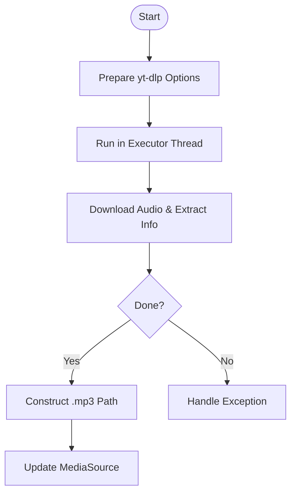

# Flowchart - MediaIngestion

## Module Overview

```mermaid
graph TD
    A[URL] --> B[IngestMediaUseCase]
    B --> C[Create MediaSource Entity]
    C --> D[AudioExtractorPort]
    D --> E[YoutubeAudioExtractor Adapter]
    E --> F{Extraction Success?}
    F -- Yes --> G[Complete Entity with Title & Path]
    F -- No --> H[Fail Entity]
    G --> I[Updated MediaSource]
    H --> I
```

## Main Functions Logic

### IngestMediaUseCase.execute

```mermaid
flowchart TD
    Start([Start]) --> UUID[Generate UUID]
    UUID --> Entity[Create MediaSource PENDING]
    Entity --> StartProc[Update Status to PROCESSING]
    StartProc --> Port[Call AudioExtractorPort.extract_audio]
    Port --> Success{Success?}
    Success -- Yes --> Return[Return COMPLETED Entity]
    Success -- No --> Fail[Return FAILED Entity]
```

### YoutubeAudioExtractor.extract_audio

```mermaid
flowchart TD
    Start([Start]) --> Opts[Prepare yt-dlp Options]
    Opts --> Thread[Run in Executor Thread]
    Thread --> DL[Download Audio & Extract Info]
    DL --> Done{Done?}
    Done -- Yes --> Path[Construct .mp3 Path]
    Path --> Entity[Update MediaSource]
    Done -- No --> Err[Handle Exception]
```
