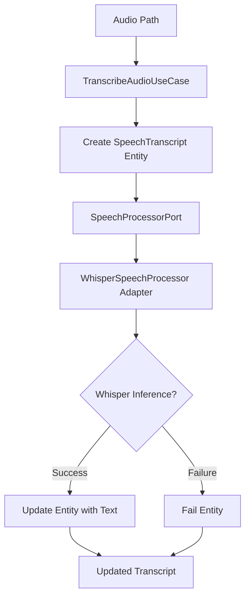
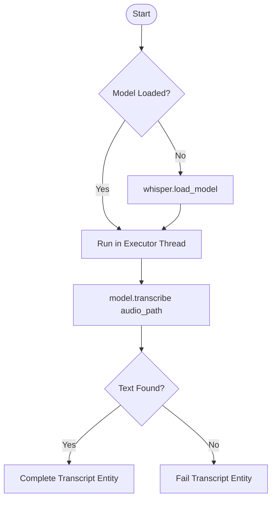

# Flowchart - SpeechProcessing

## Module Overview

```mermaid
graph TD
    A[Audio Path] --> B[TranscribeAudioUseCase]
    B --> C[Create SpeechTranscript Entity]
    C --> D[SpeechProcessorPort]
    D --> E[WhisperSpeechProcessor Adapter]
    E --> F{Whisper Inference?}
    F -- Success --> G[Update Entity with Text]
    F -- Failure --> H[Fail Entity]
    G --> I[Updated Transcript]
    H --> I
```

## Main Functions Logic

### WhisperSpeechProcessor.transcribe

```mermaid
flowchart TD
    Start([Start]) --> ModelCheck{Model Loaded?}
    ModelCheck -- No --> Load[whisper.load_model]
    ModelCheck -- Yes --> Infe[Run in Executor Thread]
    Load --> Infe
    Infe --> Trans[model.transcribe audio_path]
    Trans --> Res{Text Found?}
    Res -- Yes --> Comp[Complete Transcript Entity]
    Res -- No --> Fail[Fail Transcript Entity]
```
