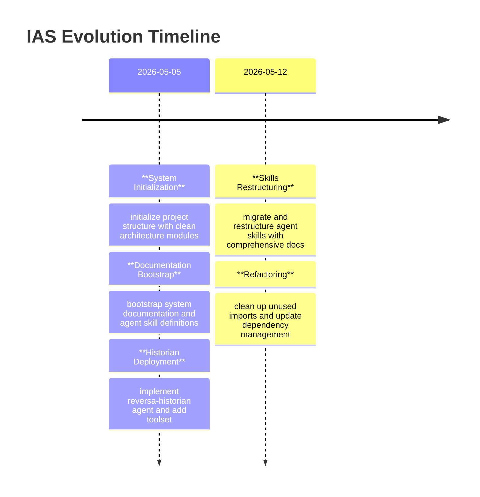

# Git Archaeology — IAS

> [!NOTE]
> This analysis was performed on 2026-05-12 based on the commit history from the repository.

## Overview
- **Total Commits:** 8
- **First Commit:** 2026-05-05T10:46:17-03:00
- **Last Commit:** 2026-05-12T11:35:31-03:00
- **Time Window:** ~1 week (Initial Bootstrap + Expansion Phase)

## Contributor Analysis
| Author | Commits | Role (Inferred) |
|--------|---------|-----------------|
| Fausto Stangler | 8 | Lead Architect / Main Developer |

**Bus Factor:** 🟢 1 (Project in initial development phase by a single architect).

## Volatility Map (Top 10 most changed directories)
| Path | Changes | Insight |
|------|---------|---------|
| `DevOps & MLOps Specialist` | 39 | Intensive knowledge base initialization. |
| `sdd` | 22 | Documentation and specification updates. |
| `sdd/media-ingestion` | 7 | Core module stabilization. |
| `sdd/knowledge-compilation` | 6 | Domain modeling focus. |
| `src/ias/modules/knowledge_compilation/domain` | 4 | Domain logic refinement. |
| `sdd/shared-kernel` | 4 | Cross-cutting concerns definition. |
| `sdd/speech-processing` | 4 | Specialized module initialization. |
| `src/ias/modules/knowledge_compilation/application` | 3 | Application layer development. |
| `tests/knowledge_compilation` | 3 | TDD and test coverage expansion. |
| `src/ias` | 3 | Source code implementation. |

## Pivotal Commits (Timeline)

### Key Milestones:
1. **Initial Bootstrap (020f95b)**: Creation of the modular monolith structure and domain folders for the three main Bounded Contexts.
2. **Documentation Surge (6a133af)**: Mass generation of SDDs and agent skills, establishing the Reversa framework within the project.
3. **Skills Restructuring (e0ee1be)**: Migration and expansion of agent skills, including testing skeletons and reference templates.
4. **Refactoring & Cleanup (4c60f2d)**: Optimization of the codebase and dependency management via `uv`.

## Insights
- **High Cohesion**: The volatility is well-distributed among the Bounded Contexts, indicating that the Modular Monolith pattern is being respected.
- **Documentation First**: The focus remains on maintaining high-quality specifications alongside code.
- **Infrastructure Maturity**: The recent restructuring of agent skills and devops docs shows a move towards operational excellence.
