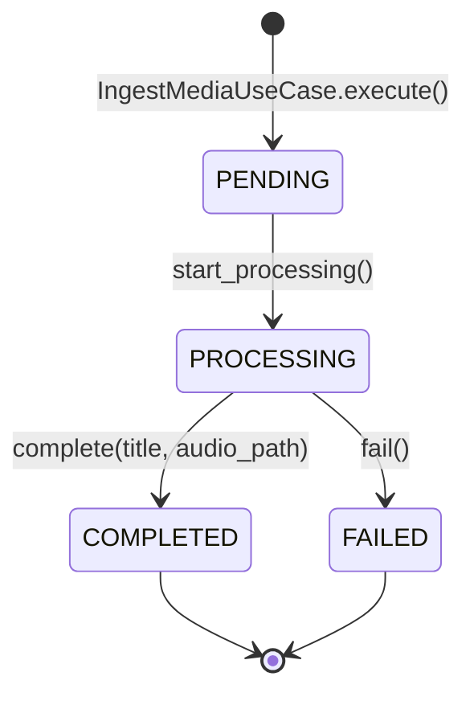
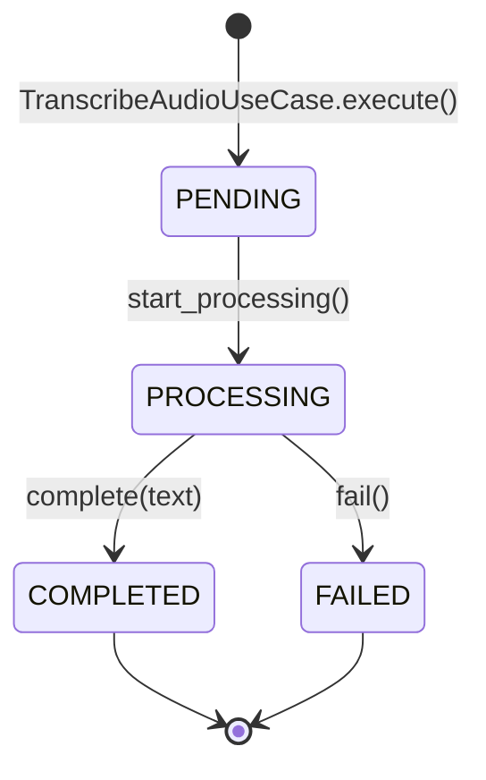
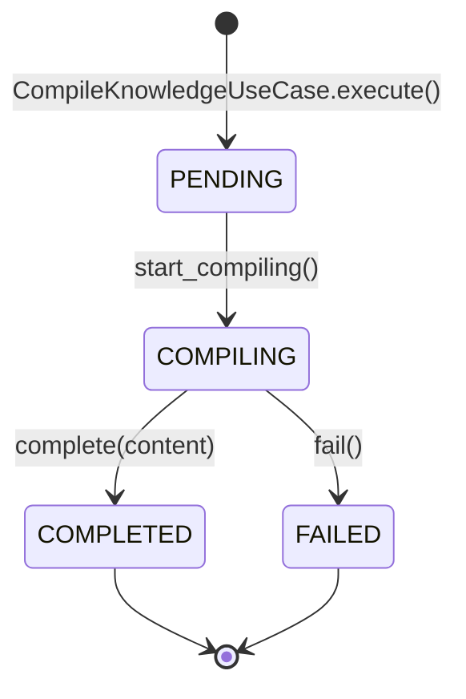

# State Machines — IAS

The IAS system manages the lifecycle of media, speech, and knowledge compilation through a set of state-controlled entities.

## 1. Media Ingestion State Machine
Controls the lifecycle of a media source URL from ingestion to audio extraction.

| State | Description | Transition Trigger |
| :--- | :--- | :--- |
| **PENDING** | Initial state after URL ingestion. | Execution started. |
| **PROCESSING** | Audio extraction (yt-dlp) is in progress. | `start_processing()` |
| **COMPLETED** | Audio file saved and metadata (title) retrieved. | Extraction success. |
| **FAILED** | Ingestion error (e.g., invalid URL, network issue). | Extraction exception. |

---

## 2. Speech Processing State Machine
Controls the lifecycle of the transcription process.

| State | Description | Transition Trigger |
| :--- | :--- | :--- |
| **PENDING** | Transcript entity created for a media_id. | Execution started. |
| **PROCESSING** | Whisper model is transcribing the audio. | `start_processing()` |
| **COMPLETED** | Transcription finished and text stored. | Transcription success. |
| **FAILED** | Transcription error (e.g., OOM, model failure). | Processing exception. |

---

## 3. Knowledge Compilation State Machine
Controls the lifecycle of the synthesis and storage into the vault.

| State | Description | Transition Trigger |
| :--- | :--- | :--- |
| **PENDING** | Knowledge node entity created. | Execution started. |
| **COMPILING** | LLM is synthesizing the transcript into Markdown. | `start_compiling()` |
| **COMPLETED** | Markdown file saved to the vault. | Synthesis & Save success. |
| **FAILED** | Compilation error (e.g., LLM error, Disk full). | Processing exception. |

---

## 🛠️ Implementation Details
- **Confidence**: 🟢 CONFIRMADO
- All states are defined as Python `Enum` classes.
- State transitions are implemented as methods on the domain entities, returning new instances (Immutability pattern).
