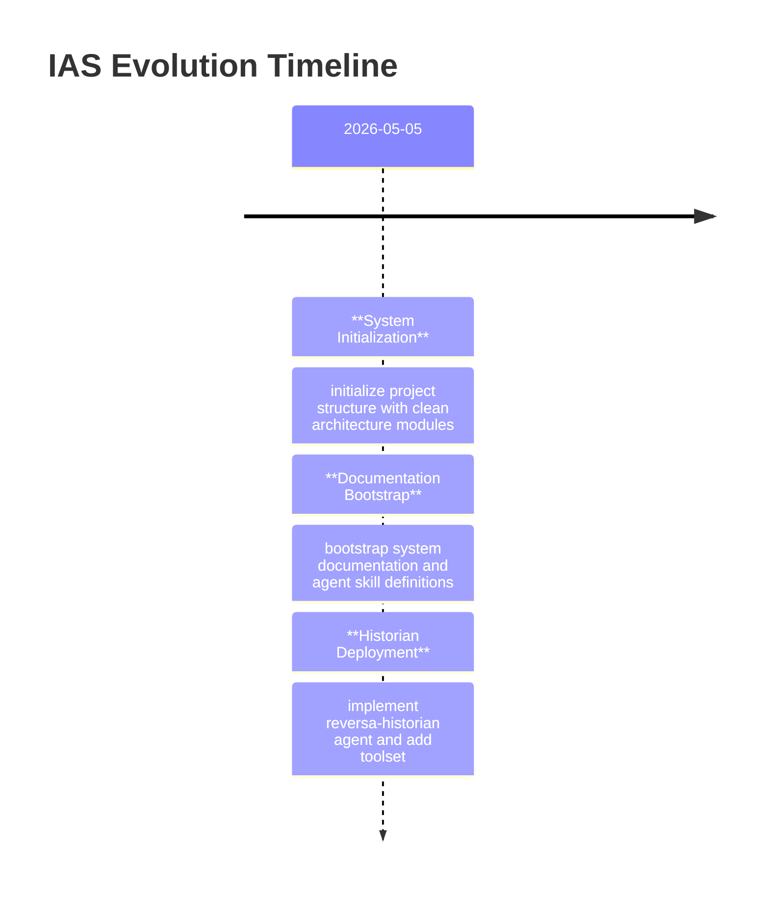

# Git Archaeology — IAS

> [!NOTE]
> This analysis was performed on 2026-05-05 based on the commit history from the repository.

## Overview
- **Total Commits:** 4
- **First Commit:** 2026-05-05T10:46:17-03:00
- **Last Commit:** 2026-05-05T13:58:09-03:00
- **Time Window:** ~3 hours (Intensive Bootstrap Phase)

## Contributor Analysis
| Author | Commits | Role (Inferred) |
|--------|---------|-----------------|
| Fausto Stangler | 4 | Lead Architect / Main Developer |

**Bus Factor:** 🟢 1 (Project in initial development phase by a single architect).

## Volatility Map (Top 10 most changed directories)
| Path | Changes | Insight |
|------|---------|---------|
| `sdd` | 17 | Intensive documentation generation. |
| `sdd/media-ingestion` | 7 | Core module stabilization. |
| `sdd/knowledge-compilation` | 6 | Domain modeling focus. |
| `sdd/shared-kernel` | 4 | Cross-cutting concerns definition. |
| `sdd/speech-processing` | 4 | Specialized module initialization. |
| `sdd/adrs` | 3 | Architecture decision stabilization. |
| `sdd/flowcharts` | 3 | Visual logic mapping. |
| `src/ias` | 3 | Source code implementation. |
| `src/ias/modules/knowledge_compilation/domain` | 3 | Domain logic refinement. |
| `src/ias/modules/media_ingestion/domain` | 3 | Domain logic refinement. |

## Pivotal Commits (Timeline)

### Key Milestones:
1. **Initial Bootstrap (020f95b)**: Creation of the modular monolith structure and domain folders for the three main Bounded Contexts.
2. **Documentation Surge (6a133af)**: Mass generation of SDDs and agent skills, establishing the Reversa framework within the project.
3. **Historian Implementation (d789600)**: Integration of automated history analysis and consolidation tools.

## Insights
- **High Cohesion**: The volatility is well-distributed among the Bounded Contexts, indicating that the Modular Monolith pattern is being respected.
- **Documentation First**: The high number of changes in `sdd/` compared to `src/` shows a strong focus on the Reversa "Specification First" approach.
- **Architectural Stability**: The presence of 3 ADRs in the first 4 commits shows that architectural decisions are being documented as they happen.
